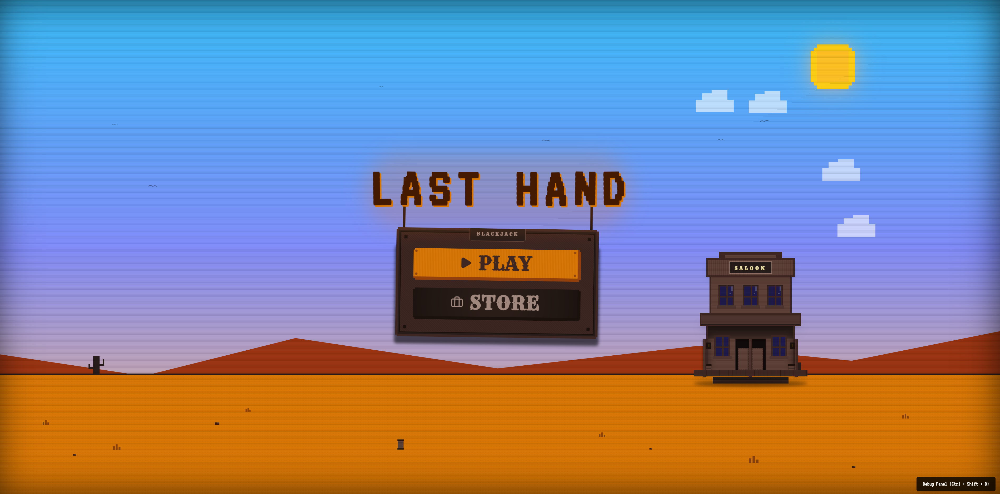
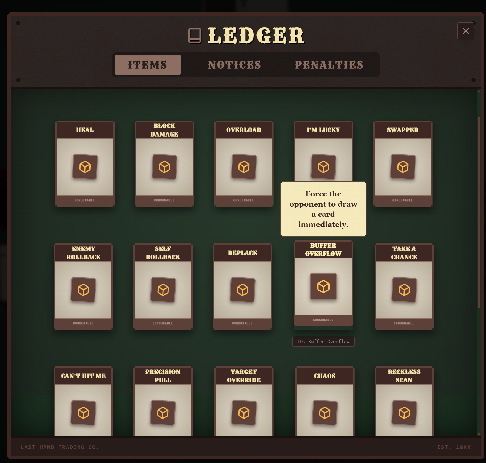
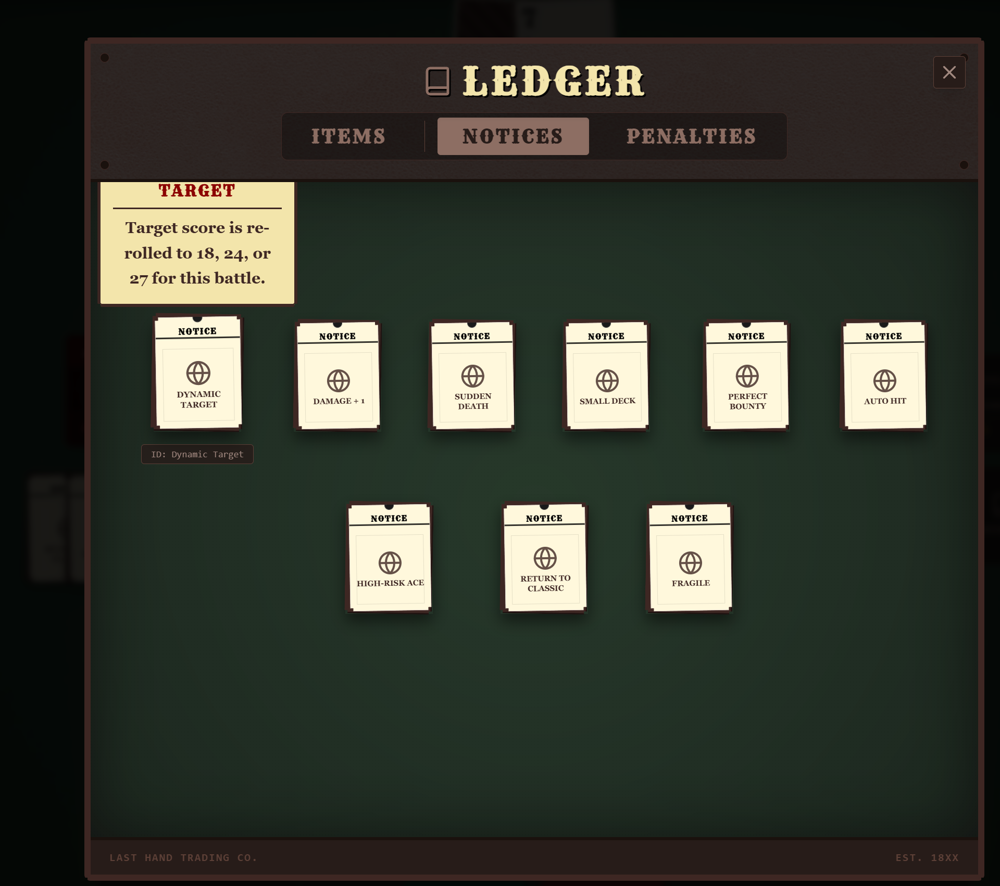
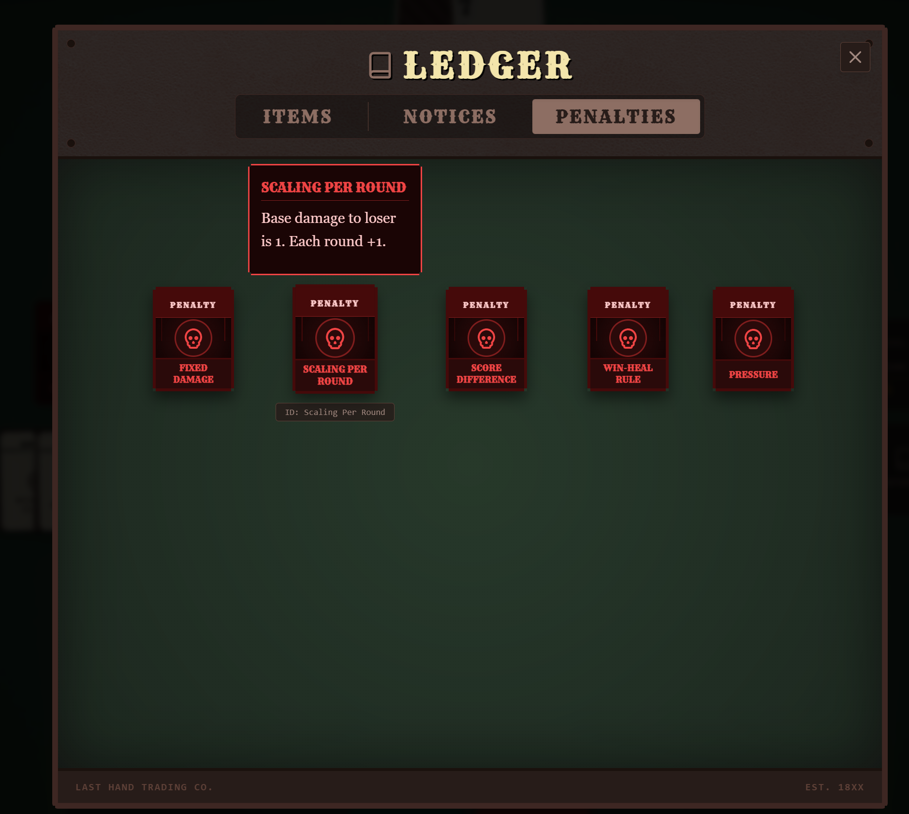

# "Last Hand" Game Proposal

## 1. Game Overview

### Core Experience

"Last Hand" is a turn-based, asymmetrical-information card game built on a simplified poker / blackjack-style mechanic, presented as a **turn-based duel + level-based Run** structure.  
In a tense, Western saloon atmosphere, the player duels a series of distinct enemies at the card table, accumulating gold and items under a high-risk ruleset and trying to push a single Run as far as possible.

The core experience can be summarized in three points:

- Making high-risk decisions in the tension of "Do I dare draw one more card?"
- Finding powerful combinations between changing environment rules (Environment Cards), punishment clauses (Penalty Cards), and tactical items, creating multi-layered mind games
- Building an increasingly stable, flexible growth route through continuous Runs and meta progression (max HP, backpack capacity), widening your decision space over time

### Core Gameplay Loop

The core loop has three nested levels: **Run → Battle → Round**.

- **Run (one complete attempt)**: From the main menu, the player starts a new Run and challenges a series of stages in order. Each stage is one **Battle**. Win to gain rewards and upgrades, then move on to a higher floor. When the player's HP drops to zero or they reach the final floor, that Run ends.
- **Battle (one full fight)**: Each Battle is tied to one enemy plus a fixed set of Environment Cards and a Penalty Card, and is made up of several **Rounds**. Every Round is a full cycle of "compare scores → apply damage". The Battle ends when either side's HP is depleted; the winner gains stage-clear rewards.
- **Round (one turn cycle)**: Both sides draw from a shared deck, trying to get as close as possible to the target score without busting. The player and the enemy take turns to **Hit (draw)**, **Stand (stop drawing)**, and **use Items**. When both have chosen Stand or one side busts, the Round is resolved and damage / healing is applied according to the current Penalty Card.

The overall core loop can be summarized as:

> Menu → Start a new Run →  
> [Battle (multiple Rounds) → Win → Rewards → Next Floor] × N → Run ends

### Player Motivation

Player motivation can be considered on three levels: short-term, mid-term, and long-term.

- **Short-term (within a single Round)**: Win the current Round, avoid busting and suffering serious punishment, and use Items / Environment / Penalty effects under partial information to maximize this Round's value.
- **Mid-term (within one Battle)**: Manage HP and shield across multiple Rounds, limit the enemy's healing and burst damage, and use win streaks, score-difference damage, and other mechanics to finish the enemy quickly while avoiding being killed by a comeback.
- **Long-term (across Runs / meta progression)**: Climb to higher floors, face stronger enemies and harsher rule combinations, and use gold to upgrade max HP and backpack capacity, unlocking safer and more flexible starting conditions for future Runs.

### Visual Style & Theme

The game uses a **Western Cowboy + saloon card table** theme.

- The main menu shows a Western town saloon exterior as the focal point: wooden buildings, a SALOON sign, tumbleweeds, and distant mountains.
- The battle screen centers on a heavy wooden table, with leather, metal rivets, and paper notice boards around it.
- Cards and UI elements use motifs such as old paper, wooden planks, and saddle bags to emphasize the lifestyle of gamblers and bounty hunters.

The mood aims for "tense but slightly tongue-in-cheek" high-stakes gambling. In one "last hand" after another, the player might strike it rich with a perfect victory, or go bankrupt on the spot because of a single bad decision.

### Concept Shots

> **Demo link**:  
> https://blackjack-v0-4-complete-menuscreen-before-environ-196564664072.us-west1.run.app/

## 2. Story & Narrative

### World Background

While the game does not follow a linear script, its visuals and copy suggest a world like this:  
The story takes place across frontier wastelands and scattered small towns, where laws are loose and the card table itself stands in for "rules". All kinds of "patrons"—from ordinary travelers to professional gamblers—wager their wealth and fate here.

### Player Role

The player is a **professional gambler / bounty hunter** who has long haunted the Last Hand Saloon.  
They have gathered rich experience across countless tables, with a sharp sense of card probabilities and opponent psychology. Yet they are not satisfied with small, safe wins; instead, they want to challenge ever more dangerous opponents and rule sets through a series of high-risk Runs, in exchange for greater bounties and fame.

All meta upgrades (max HP, backpack capacity, gold reserves) can be seen as the "accumulated scars and history" of this gambler's long career.

### Enemies

Enemies appear as personified or symbolic characters, for example:

- **Greedy type**: Keeps drawing until very close to the target score. A typical image might be a "never-satiated ghost gambler" and similar.
- **Defensive type**: Tends to Stand at relatively low scores, prioritizing safety and consistency.
- **Random type**: Highly unpredictable behavior—sometimes aggressive, sometimes conservative—representing chaos, unstable mentality, or inexperienced newcomers.

Different AI styles create very different kinds of pressure:

- Some opponents "always want one more card": they bust often but, when they succeed, can deal huge damage.
- Some are extremely cautious: they rarely make mistakes, but also struggle to deliver a killing blow.
- Some are entirely irrational: you cannot reliably predict their choices and are forced to focus more on your own hand and the global rules.

## 3. Characters & Enemies

### Player

#### Behavior Logic

In combat, the player's core actions are: Hit, Stand, and use Items.

- **Hit (draw)**: Draw the top card from the shared deck and add it to your hand. Cards are dealt face-down then flipped, reinforcing suspense. After the card is revealed, the score is recalculated immediately and control usually passes to the opponent.
- **Stand**: Stop drawing in this Round and lock in your current score. Control passes to the opponent. When both sides are Standing, the Round immediately goes to resolution.
- **Use Item**: Play an Item Card from your backpack to instantly change your hand, score, damage resolution, or HP. Items are generally single-use, and other operations are briefly locked during their effect to highlight their importance.

#### Status & Attributes

Important player attributes during a Battle:

- **HP and Max HP**: Total damage you can survive.
- **Shield**: Absorbs damage first during resolution; only when Shield is depleted does HP go down.
- **Hand & Score**: Cards drawn this Round and their total point value.
- **Backpack & Capacity**: The number of Items you can carry.

Between Runs, the player also has meta progression attributes:

- **Gold**: Used to purchase long-term upgrades in upgrade screens.
- **HP Upgrade Level**: Determines starting Max HP for each new Run.
- **Backpack Upgrade Level**: Determines base backpack capacity and starting Items for each new Run.

### Enemies

#### Enemy Behavior Model

Enemies share the same basic action set as the player (Hit / Stand / potentially use Items), but are fully AI-driven.  
An enemy estimates the risk of drawing again based on its current score, the target score, and the current Environment rules, and its risk preference depends on its AI style:

- Greedy types tend to keep drawing in high-score ranges as long as they are not dangerously close to busting.
- Defensive types choose to Stand at lower scores, valuing stability and not busting.
- Random types behave unpredictably in borderline situations, sometimes wise, sometimes reckless.

Whenever it's the enemy's turn, a short "thinking delay" is inserted to create the sense that the opponent is hesitating and weighing options.

#### Enemy Attributes & Differences

Enemies have roughly the same combat attributes as the player: HP and Max HP, Shield, Hand & Score, Backpack & Capacity.

Key differences:

- Enemy HP and Shield scale with floor number and difficulty.
- Enemy backpacks and Items primarily show that enemies also have resources, and leave room for future expansion of "enemy item strategies".
- Enemy behavior is fully AI-driven; players cannot directly control it, but can indirectly influence the enemy's situation through Items and Environment rules—for example, forcing a draw, undoing the enemy's last card, or swapping the last cards of both sides.

## 4. Core Gameplay Mechanics

### Round System

#### Draw & Deal Flow

At the start of each Round:

1. The system clears temporary states from the previous Round—damage modifiers, immunity effects, temporary target scores—so that the new Round starts from a clean and fair baseline.
2. It constructs the deck for this Round: a simplified set of cards **1–10 + A (11 cards total)**.  
   If an Environment effect removes certain cards, those cards are randomly disabled before the Round and are displayed in the UI as "crossed-out cards".
3. Initial hands are dealt. Both sides draw alternately (e.g., "Player–Enemy–Player–Enemy" two cards each). All of the player's starting cards are face-up; at least one enemy card remains face-down, with the rest revealed, to create information asymmetry.

On your turn, you weigh **Hit** versus **Stand**:

- Pressing **Hit** draws one card, immediately updates your score, and typically hands control to the opponent (unless the opponent has already Stood).
- Pressing **Stand** means you will not draw further this Round; your score is locked and control passes to the opponent. Once both sides are Standing, the Round immediately proceeds to resolution.

During combat, the Hit / Stand decision must consider:

- Your current score versus the target score.
- The remaining card distribution shown in the Deck Tracker.
- The enemy's known and unknown score, plus its behavior style (Greedy / Defensive / Random).
- How current Penalty and Environment rules magnify the cost of losing this particular Round.

#### Resolution & Bust Handling

When both sides have chosen Stand, the Round enters resolution:

1. The enemy's face-down card is revealed; both hands are now fully visible.
2. Final scores are computed for both sides using the current target score and A (Ace) logic.
3. Bust and win / loss are then determined:
   - If a side's score exceeds the target score, or hits a special bust value (e.g., certain Environments may define 17/18 as bust), that side is considered busted.
   - If both sides bust, the Round is a draw.
   - If only one side busts, the other side wins.
   - If neither busts, the higher score wins; equal scores result in a draw.
4. Once the winner is determined, HP and Shield changes are applied to both sides according to the current Penalty Card's rules.

### Battle System

#### Battle Setup

At the start of each Battle:

- The system selects the enemy for this floor.
- It draws several Environment Cards and one Penalty Card to form the **global rule set** for this Battle.
- Player and enemy Hands, Scores, Shields, and Round counters are reset.

The first Battle of a Run functions as a tutorial: Environments and Penalties are relatively forgiving. As floors increase, combinations become harsher—for example, automatic draws, extra damage, or sudden-death thresholds.

#### Environment Cards & Penalty Cards

Within a Battle:

- **Environment Cards** define the global rules for the entire fight.
- **Penalty Cards** define the specific cost of winning or losing each Round.

Environment Cards may:

- Change target score and scoring logic (including A behavior and special bust values).
- Adjust deck size and automatic draws per Round.
- Grant extra rewards on perfect scores.
- Restrict Item usage.
- Introduce sudden-death HP thresholds.

Penalty Cards only apply at Round resolution, but are crucial for long-term pacing. They may:

- Define damage / healing distribution each Round.
- Track win streaks across Rounds and scale punishment effects over time.

Together, Environment + Penalty work like "tournament rules + referee clauses":  
Environment sets overall pacing and risk level, while Penalty defines the exact cost of winning or losing each Round.

#### Battle Outcome & Reward Flow

When either side's HP drops to 0 or below, the Battle ends immediately.

- If the enemy dies, the Battle is won. The system grants base rewards plus bonus gold scaling with floor number, then shows a Victory screen and transitions into a reward selection screen where the player chooses new Items.
- If the player dies, the Battle is lost. The Run ends at once and the Game Over screen is shown, including highest floor and total gold accumulated in this Run.

After a Battle victory, the reward phase lets players pick several Items from a randomly generated pool (limited by backpack capacity). Leaving the reward screen sends the player to the next floor and a new Battle.

### Run System

#### Linear Floor Progression

The current Run structure uses **linear floor progression**.

- A Run starts at floor 1.
- Every Battle victory increases the floor number by 1.
- Higher floors generate stronger enemies and tougher Environment / Penalty combinations.
- Gold and meta upgrades accumulate across the entire Run.

Difficulty increases monotonically with floors, naturally dividing a Run into **early / mid / late** stages—each with distinct tactical challenges (different enemies + rule combinations).

In a typical Run:

- **Early floors**: Rules are moderate; players mainly learn the system and UI. A few Items already allow simple tactics.
- **Mid floors**: Enemy HP increases; Environments introduce auto draws, sudden-death thresholds, and other high-pressure elements. Penalties use win-streak bonuses, score-difference damage, etc., making every lost Round painful. Players must carefully choose when to chase perfect scores and when to cut losses.
- **Late floors**: After several high-pressure Battles, player HP and Shields are heavily depleted. Environments may stack multiple negative rules, leaving very little room for error. Under both harsh Environments and Penalties, any bust or misjudgment may end the entire Run.

## 5. Materials & Assets (Cards & Content)

### Item Cards

Item Cards are one of the most important tactical resources in the game, and are all single-use. Their effects are strictly limited to the Round or Round-resolution level and do not directly change Run structure, making them more like a "tactical toolbox" than simple numeric multipliers.

Main item types include:

- **Healing & Protection**: Direct healing (e.g., recover a fixed amount of HP), damage buffering (reduce damage taken this Round), or full damage immunity for this Round. Often used before risky plays or when close to sudden-death thresholds.
- **Backpack-based Healing**: Heal based on the number of Items currently in your backpack, encouraging "hoarder" builds that stockpile Items for massive recovery at key moments.
- **Draw Optimization**:
  - "Best draw": simulate candidate cards in the current deck and choose the one closest to the target score.
  - "Draw specific value": attempt to draw a particular number (e.g., exactly +3 or an A).  
  Both significantly increase draw certainty and are key tools for advanced players.
- **Target Score & Round-Condition Modifiers**: Temporarily change the target score for this Round (e.g., shift from 18 to 24), or add conditions like "if you don't bust, deal extra damage to the loser". These redefine what it means to "win a Round" when base conditions are unfavorable.
- **Card Manipulation & Information Rebuild**: Swap the last cards between players, undo the last draw (yours or the enemy's), or replace your last card. These locally repair bad draws or erase the enemy's perfect draw while preserving the overall evolution of the shared deck.
- **Forced Enemy Actions**: Force the enemy to immediately draw and reveal a card, especially powerful when the enemy is already in a dangerous score range.
- **Life-for-Resources**: Trade HP for card or Item advantage—for example, "draw 2 random Item Cards but take 2 damage". These encourage high-risk, proactive self-damage plays when HP is healthy.
- **Life Steal & Random Effects**: Drain a small amount of HP from the enemy and heal yourself, or borrow random effects from other Items to increase unpredictability and drama across a Run.

Players do not need to memorize complex numbers; a handful of keywords and icons are enough to understand each Item's purpose. However, when combined with Environments and Penalties, Items can still form highly distinct and deep tactical systems.

### Environment Cards

Environment Cards act like "bulletin boards" describing rule exceptions for the entire Battle. The design goal is to diversify each Battle's tempo and difficulty without changing the core "compare score" mechanic.

Main axes of influence:

- **Target Score & Scoring Rules**:
  - Adjust the default target score (e.g., change from a standard value to 18, 24, 27, etc.).
  - Define whether A always counts as 11 or can flex between 1 and 11.
  - Mark certain scores (e.g., 17/18) as bust.
- **Deck Size & Draw Tempo**:
  - Randomly disable several cards before a Round to shrink the deck.
  - Automatically deal extra cards to both sides each Round, speeding up the tempo and changing card-counting difficulty and risk curves.
- **Rewards & Item Rules**:
  - Grant extra Item Cards for perfect scores.
  - Completely forbid using Items, forcing pure Hit / Stand duels.
- **Win / Loss & Death Rules**:
  - Introduce additional defeat conditions, such as "HP at or below X triggers sudden death", turning the match from a slow war of attrition into a high-pressure battle.

### Penalty Cards

Penalty Cards are the "house rules" that define the **specific cost of winning or losing each Round**. They only trigger at Round resolution and do not change in-Round draw / Stand mechanics, but strongly shape how players evaluate risk each Round.

Typical penalty types:

- **Flat Damage**: Whenever there is a clear loser, they take fixed damage. Simple and easy to understand.
- **Round-Count Scaling**: Base penalty damage increases linearly as the Battle goes on, forcing both sides to end the fight sooner and avoid the huge cost of dragging things out.
- **Score-Difference Damage**: Damage equals the difference in final scores, encouraging players to press their advantage and chase big score gaps.
- **Damage + Healing Mix**: Deals damage to the loser while healing the winner, emphasizing the long-term value of winning Rounds for HP management.
- **Win-Streak Stacking**: Base damage is fixed, but consecutive wins by the same side add extra damage. Draws or losses reset the streak, building toward a high-pressure state over multiple Rounds.

### Playing Cards (1–10 + A)

#### Card Values & Deck Setup

The game uses a single-suit, simplified deck:

- Cards: numbers **1–10** plus **A** (Ace) → 11 total cards.
- No J, Q, or K face cards.
- Ace's base value is 11, but under some rules it can fall back to 1 automatically.

This small, fixed-composition deck makes it easy to count cards and estimate probabilities. Players can quickly grasp all possible combinations and risks.

#### Shared Deck & Tactical Depth

The player and enemy share the same 11-card deck, which is reshuffled and partially disabled across a Battle. Any card drawn by one side reduces the other's future draw options.

Through the in-game **Deck Tracker**, players can clearly see:

- Which values have already been played.
- Which values have been disabled by Environments.
- Which ones remain in the deck.

Most Items only touch the most recent draws (undo, replace, swap), and do not retroactively alter the entire match history, keeping the evolution of the shared deck traceable.

Within a simple "compare score" frame, this small shared deck plus explicit information display introduces considerable depth in card-counting and probability play.

## 6. Uniqueness & Design Rationale

### Configurable Rule Environments

One of the game's most distinctive features is **configurable combat rules via Environment Cards**.  
Each Battle is defined by a different combination of Environment rules, which can simultaneously change:

- Target score and Ace logic
- Bust thresholds
- Deck structure
- Automatic draws
- Item availability
- Death conditions

Before every fight, players must read and understand this set of "announcements" and build their strategy around them.  
Compared to fixed rules, this greatly increases replayability and strategic variety: the same Item loadout can produce very different outcomes and risk profiles in different Environments.

### Penalty System & Win-Streak Pressure

Penalty Cards elevate "losing this Round" from a simple win / loss result to a nuanced cost curve:

- Some rules encourage ending the Battle quickly (penalties grow as Rounds pass).
- Some encourage large score gaps (bigger difference → heavier punishment).
- Some stack damage for win streaks, pushing matches into high-pressure states.
- Others redistribute HP and resources between winner and loser.

Under such a system, a Round is no longer just about "Did I win?". It pushes players to ask:

- "Do I risk busting for a chance at a huge score gap?"
- "As win-streak penalties ramp up, should I intentionally drop a Round to reset the pressure?"

### Lightweight Yet Deep Item Play

The Item system follows two principles:

- Effects should be simple and easy to understand.
- Combinations should have depth.

Most Items perform "second-order" processing on existing rules rather than introducing totally new systems. Common directions include:

- Changing draw expectations (best-draw, specific-value draw).
- Manipulating the last few cards (swap, undo, replace).
- Adjusting damage / healing distribution at Round resolution (buffer, bonus, immunity, extra damage to the loser).
- Trading HP for more card options and future healing potential.

Players don't need to memorize complicated numbers; a few keywords and icons suffice. Yet, across many Items, Environments, and Penalties, it's still possible to build highly distinctive tactical archetypes.

### Roguelite Structure & Meta Progression

By introducing Runs and meta upgrades, the game adds a light **Roguelite** layer on top of single-fight duels.

- The outcome of each Run affects starting power for the next Run.
- Players can spend gold on immediate Item purchases (if a shop layer is added in the future) or long-term HP / backpack upgrades.
- As upgrades accumulate, players become able to survive harsher Environment / Penalty combinations and explore higher floors.

This structure appeals to:

- Players who like short, fast matches (they can focus on a single Battle or a single Run).
- Players who enjoy long-term accumulation and buildcrafting (they can slowly build a growth route over many Runs).

### Shared Deck & Information Clarity

Unlike many games that internally share decks but do not clearly display state, this game uses a small, fixed-composition deck and provides an explicit **Deck Tracker**:

- A small, fixed deck makes tracking easier.
- The Deck Tracker UI clearly shows the status of all card values.

As a result, card-counting is no longer an advanced-only skill; it becomes an "information asset" that every player can use:

- Players who prefer to rely on intuition and probability feel can still make smooth Hit / Stand decisions.
- Players who prefer precision can systematically count cards, infer remaining compositions, and combine Items to build intricate tactics.

Within the same ruleset, this supports multiple depths of play and allows for tactical systems with a strong, distinct identity.

### Roguelite Structure & Meta Progression (Reiterated)

Again, through the Run concept and meta progression, the game overlays a light **Roguelite** layer atop individual matches:

- The result of a single Run influences starting power in the next Run.
- Players can choose between spending gold on immediate Item purchases (future shop nodes) or on long-term HP / backpack upgrades.
- As upgrades are completed, players will find themselves able to handle increasingly harsh Environment / Penalty combinations and reach higher floors.

This structure simultaneously satisfies:

- Players who prefer short, fast-paced sessions and can focus on a single Battle or a single Run.
- Players who enjoy long-term accumulation and construction and can slowly build their growth paths over many Runs.

### Shared Deck (Reiterated)

Similarly, the shared-deck design emphasizes visible information and accessible depth:

- A small, fixed-composition deck
- An explicit Deck Tracker UI

Card-counting is thus no longer a niche skill. Every player can directly leverage the information:

- Intuition-driven players can operate purely on feel and simple probability.
- Calculation-heavy players can systematically track cards, project the remaining deck, and combine Items to execute precise tactics.

This shared-deck concept, along with visible information, supports tactical systems with a clear and recognizable character.

